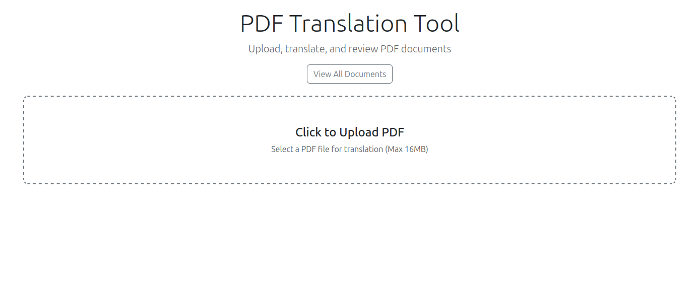
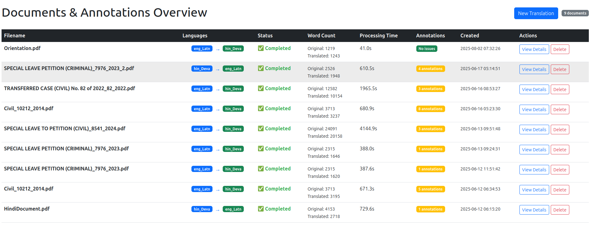
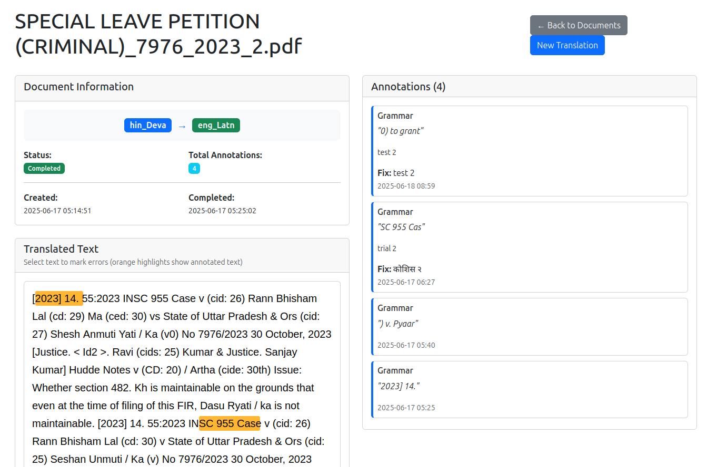

## Judicial Translation En-Hi

It utilizes the IndicTransToolkit library to translate judicial documents from English to Hindi.

it use "Indicbert 1B" model for translation.


### Installation

```bash

python3 -m venv venv
source venv/bin/activate
pip install -r requirements.txt

```

```bash

1. Clone the repository: git clone https://github.com/VarunGumma/IndicTransToolkit
2. cd IndicTransToolkit
3. pip install --editable . --use-pep517               ## in case it fails, try:  pip install --editable . --use-pep517 --config-settings editable_mode=compat
4. python -m spacy download en_core_web_sm


```

### Usage

```bash

python run.py

```


### Output









